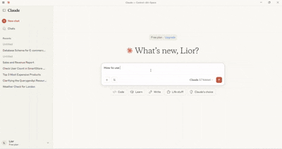

# Web Security Scanner MCP Server

An MCP server that provides tools for scanning web applications for common security vulnerabilities.

## Demo




## Features

- Scans for Cross-Site Scripting (XSS) vulnerabilities
- Detects potential Cross-Site Request Forgery (CSRF) issues
- Identifies potential Open Redirect vulnerabilities

## Installation

1. Clone this repository
2. Install dependencies:
```bash
npm install
```

## Building

```bash
npm run build
```

## Usage with Claude Desktop
On Windows: %APPDATA%/Claude/claude_desktop_config.json
```json
{
  "mcpServers": {
    "web-security-scan": {
      "command": "node",
      "args": [
        "C:\\path\\to\\mcp-web-security-scan\\dist\\server.js"
      ]
    }
  }
}
```


## Usage

The server provides the following MCP tool:

### scan-website

Scans a website for security vulnerabilities.

Parameters:
- `url`: The URL of the website to scan (must be a valid URL)
- `scanTypes`: Array of scan types to perform. Must include at least one of:
  - `xss`: Cross-Site Scripting scan
  - `csrf`: Cross-Site Request Forgery scan
  - `openredirect`: Open Redirect vulnerability scan
  - `sensitive `: Sensitive information disclosure scan
  - `sqlinjection`: SQL injection vulnerabilities
  - `headers`: Security header analysis
  - `infodisclosure`: Information disclosure vulnerabilities
  - `traversal `: Directory traversal vulnerabilities

Example usage with MCP client:

```typescript
const result = await client.callTool({
  name: "scan-website",
  arguments: {
    url: "https://example.com",
    scanTypes: ["xss", "csrf", "openredirect"]
  }
});
```

## Development

To run in development mode with automatic reloading:

```bash
npm run dev
```

## License

MIT 